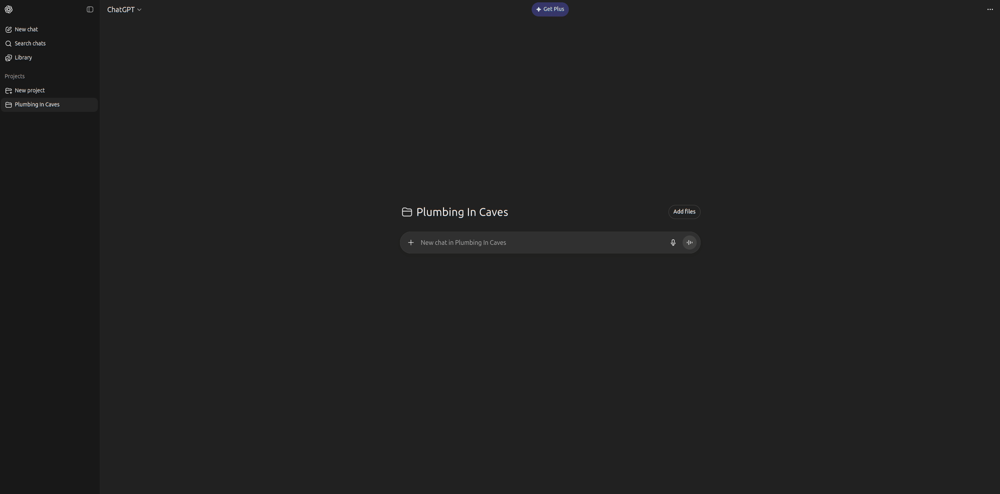
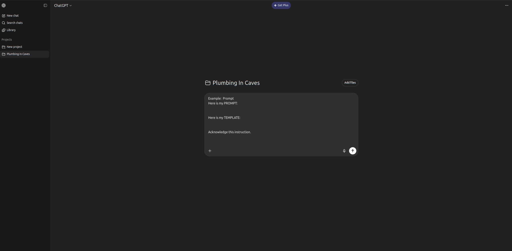

### 🧭 Step 1 — Create a New Project Folder
Make a folder for your topic (e.g., `Coding Studies`, `Plumbing`, `Rocket Science`, `Calculas`, etc).

### 🧩 Step 2 — Add Project Instructions
Add the following instructions to your project folder: (ChatGPT example)
*Update the project specifics to fit your project topic*

```yaml
project_topic:
  name: "<Your Project Name>"
  description: "<Short description of what this folder covers>"
  scope:
    include:
      - notes and guides directly related to the topic
    exclude:
      - unrelated technologies or off-topic commentary

## 📐 Rules
1. Use ONLY the provided templates (`*_template.md`) and prompts (`*.prompt.md`).
2. Follow the section order and structure exactly.
3. Stay within the declared topic scope.
4. Output new content in the correct category (atoms, exercises, how-to, logs, transcripts).
5. Update `dashboard_template.md` when adding new content.

## 🎛️ Response Convention
- **Explain** → `atom_template.md`
- **Guide / How-To** → `how_to_template.md`
- **Practice** → `exercise_q_template.md`
- **Reflect** → `journal_logs_template.md`
- **Overview** → `dashboard_template.md` or `course_readme_template.md`
- **Transcript** → `meeting_transcript_template.md` or `video_to_atom_template.md`
```



## 💬 Paid vs Free LLM's
DreamBase works with **any** language model — paid or free — as long as it can process Markdown input and follow structured prompts.  
Here’s how the setup differs:

### 💎 Paid LLMs (e.g., ChatGPT Plus, Claude Pro)

- ✅ You can **upload** all your template (`*_template.md`) and prompt (`*.prompt.md`) files directly into a **Project Folder**.


### 🪶 Free LLMs (e.g., ChatGPT Free, Ollama + OpenWebUI, Gemini, Mistral)

- ⚙️ You’ll need to **manually construct your prompts to fit the desired output** at the start of each chat.
    > Example:  Prompt
    > Here is my PROMPT:
    > *paste the contents of the associated \*_promtp.md*
    > Here is my TEMPLATE:
    > *paste the contents of the associated \*_template.md*
    > Acknowledge this instruction.
- 🚀 This will ensure the model creates a chatbased memory locked to the desired template. 
- ✅ You will need to do this for every template type you want to use.

